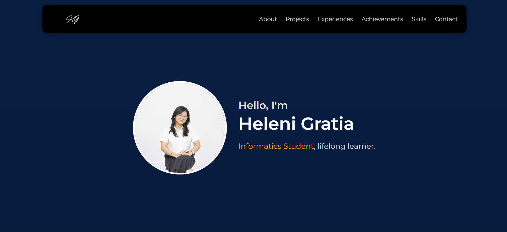

<div align="center">
  <h1>Personal Portfolio</h1>
  <h3>Showcasing My Work and Journey</h3>
  <p><em>This project was developed as part of the <strong>Web Application Development</strong> course</em></p>
  <p>
    
    
    
  </p>
  
</div>


## Description
**Personal Portfolio** is a simple website built to introduce myself, showcase my experiences, projects, skills, and achievements.  
It was created using **HTML** and **CSS**, designed to be responsive, easy to navigate, and serve as a digital representation of my journey in technology.

##  Key Features
- **About Me**: A short introduction about myself  
- **Projects**: A collection of projects I have worked on  
- **Experiences**: Organizational and professional experiences  
- **Achievements**: Key milestones and recognitions  
- **Skills**: Technical skills I have mastered  
- **Responsive Design**: Optimized for desktop, tablet, and mobile views  

##  How to Run
1. Clone the repository and open the project folder:
   ```
    git clone https://github.com/mineraleee/PortfolioWeb
    cd PortfolioWeb
   ```
2. Open the index.html file in your browser.

## Deployment
You can access the deployed version of this project here: heleni-portfolio.vercel.app

## Author
<table>
  <tr>
    <td align="center">
      <a href="https://github.com/mineraleee">
        <br />
        <span><b>Heleni Gratia</b></span>
      </a>
    </td>
  </tr>
</table>


<div>
  <strong>Web Based Development</strong><br>
  <em>Personal Portfolio</em>
</div>